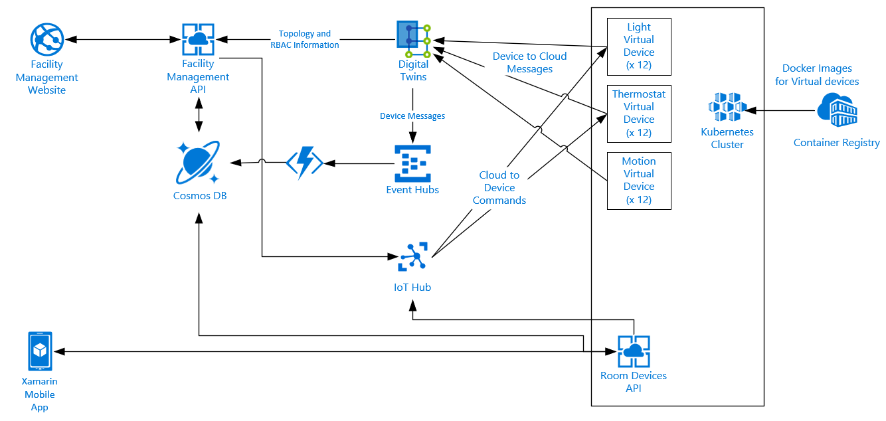
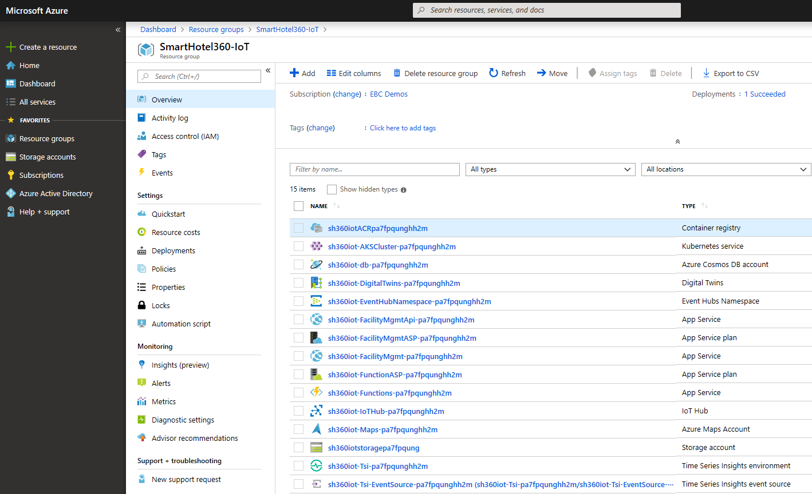
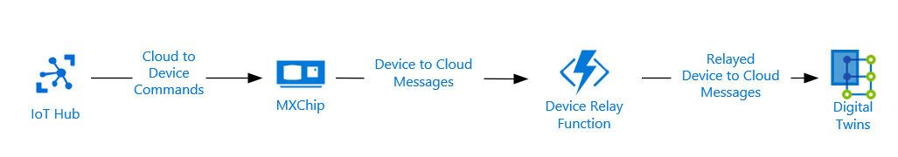

# SmartHotel360
During **Connect(); 2017** event this year we presented beautiful app demos using Xamarin and many features of Azure. For //build/ 2018's keynote, we updated some components of the back-end API code to support **Azure Kubernetes Service (AKS)**. This repository contains the setup instructions and sample code needed for the Internet of Things (IoT) Demo utilizing Digital Twins that was announced at **Ignite 2018**.

# SmartHotel360 Repos
For this reference app scenario, we built several consumer and line-of-business apps and an Azure backend. You can find all SmartHotel360 repos in the following locations:

- [SmartHotel360](https://github.com/Microsoft/SmartHotel360)
- [IoT](https://github.com/Microsoft/SmartHotel360-IoT)
- [Mixed Reality](https://github.com/Microsoft/SmartHotel360-MixedReality)
- [Backend](https://github.com/Microsoft/SmartHotel360-Backend)
- [Website](https://github.com/Microsoft/SmartHotel360-Website)
- [Mobile](https://github.com/Microsoft/SmartHotel360-Mobile)
- [Sentiment Analysis](https://github.com/Microsoft/SmartHotel360-SentimentAnalysis)
- [Registration](https://github.com/Microsoft/SmartHotel360-Registration)

# SmartHotel360 - IoT Demo

Welcome to the SmartHotel360 IoT repository. Here you'll find everything you need to run the website and backend for the IoT demo.



Check out our [Channel9 IoT Show Video](https://channel9.msdn.com/Shows/Internet-of-Things-Show/SmartHotel-360-a-demo-powered-by-Azure-Digital-Twins) about the SmartHotel360 Demo Powered by Digital Twnis:

[](https://www.youtube.com/watch?v=urcmaFVQnF4)

## Live Running Website

We have deployed a public environment to show the end result of the website connected to the Digital Twin Solution. Please notice the sliders control will be disabled because we are using the [basic authentication mode](https://github.com/Microsoft/SmartHotel360-IoT#basic-authentication-mode).

* Website: https://aka.ms/smarthotel360-FacilityManagement
* Username: admin
* Password: admin


# Getting Started

SmartHotel360 uses a **microservice oriented** architecture implemented using containers. For the IoT Demo, there are various services developed in different technologies: .NET Core 2, ASP.NET Core 2, and Angular. These services use different Azure Resources like Digital Twins, App Services, Cosmos DB, Event Hubs, Azure Functions, and IoT Hubs to name a few. The step by step walkthrough for creating and provisioning the demo can be found next in the [Setup](#Setup) section.

End-to-end setup takes about an hour provided you have all of the development environment prerequisites met AND that your user has the required permissions in your Azure subscription.

## Demo Scripts

You can find a **[demo scripts](Documents/DemoScript)** with a walkthroughs once you have finished the setup of this demo.

# Setup

## Prerequisites

* Powershell for running provisioning Azure provisioning scripts. [Powershell Core](https://docs.microsoft.com/en-us/powershell/scripting/setup/installing-powershell-core-on-macos?view=powershell-6) is available for Mac and Linux users.
* [Docker](http://www.docker.com) to build the containers.
* [Visual Studio 2017](https://www.visualstudio.com) with the `.NET desktop development` and  `ASP.NET and web development` workloads installed.
* [Azure CLI](https://docs.microsoft.com/en-us/cli/azure/install-azure-cli?view=azure-cli-latest)
* [Kubernetes CLI](https://kubernetes.io/docs/tasks/tools/install-kubectl/)
* [Angular CLI](https://cli.angular.io/)
* You also will need the Azure IoT Extension for Azure CLI. You can install it with the following command:
```
az extension add -n azure-cli-iot-ext
```
> Note: We have updated the deployment script to work with version 0.7.0 or higher.

* **Required Azure Subscription Permissions**
  1. Create and modify Azure AD Application Registrations or have someone else do it for you
  2. Create a new Service Principal for Role Based Access Control (RBAC) or have someone else do it for you
  3. Create or add 2 new guest users to the Active Directory (AD) or have someone else do it for you and get you the Object Ids of those users
  4. Create a ResourceGroup or have one that someone else already created for you to use
  5. Create a deployment into a ResourceGroup
  6. Give the Service Principal in #2 read permissions to read from the ACR created by the deployment (if not, then script provides the user with an Azure Cli command to execute to be run by someone with the required permission, and pauses until the user says this step has been completed)

## Set up a Service Principal and register an Azure Active Directory application

 Follow these instructions to [create a service principal and register an Azure Active Directory application](https://docs.microsoft.com/en-us/azure/azure-resource-manager/resource-group-create-service-principal-portal?view=azure-cli-latest).

* Choose `Web app / API` as the Application Type

During the creation process you will need to take note of the following information:

* Tenant Id
* App Id
* App Key

### Obtain the service principal Id
To obtain the service principal Id, open a **Powershell** window and follow these steps:
1. `Login-AzureRmAccount -SubscriptionId {subcription id}`
2. `Get-AzureRmADServicePrincipal -ApplicationId {app Id}`

* If `AzureRM` is not installed you will receive errors saying that it needs to be installed. Run the following command in an Administrator Powershell: `Install-Module -Force AzureRM`

### Set permissions and security for the Application

Click settings --> Required Permissions
* Digital Twins API
  * Click `Add` on the top left
  * Under select an API, type `Azure`, then choose `Azure Digital Twins (Azure Smart Spaces Service)`
    * NOTE: If this option does NOT show, you may need to register the Digital Twins resource provider using the following steps in a **Powershell** window:
       1. `Login-AzureRmAccount -SubscriptionId {subcription id}`
       2. `Register-AzureRmResourceProvider -ProviderNamespace 'Microsoft.IoTSpaces'`
       3. Wait until the provider registration is complete, can be checked via: `Get-AzureRmResourceProvider -ProviderNamespace 'Microsoft.IoTSpaces'`
  * Check the Read/Write Access delegated permissions box
  * Save
* Time Series Insights API
  * Click `Add` on the top left
  * Under select an API, type `Azure`, then choose `Azure Time Series Insights`
    * NOTE: If this option does NOT show, you may need to register the Time Series Insights resource provider using the following steps in a **Powershell** window:
       1. `Login-AzureRmAccount -SubscriptionId {subcription id}`
       2. `Register-AzureRmResourceProvider -ProviderNamespace 'Microsoft.TimeSeriesInsights'`
       3. Wait until the provider registration is complete, can be checked via: `Get-AzureRmResourceProvider -ProviderNamespace 'Microsoft.TimeSeriesInsights'`
  * Check the Access Azure Time Series Insights service delegated permissions box
  * Save
* Click `Grant Permissions` (right next to the Add button).

## Create a service principal for AKS Cluster
To create a service principal for an AKS Cluster, open a **Powershell/Command Prompt/Bash** window and follow these steps:
1. `az login`
2. `az account set -s {subscription id}`
3. `az ad sp create-for-rbac --skip-assignment`

The `sp create-for-rbac` command will return a json object that will have the information needed later in this process.

```json
{
  "appId": "{aks app id}",
  "displayName": "{aks display name}",
  "name": "{aks uri}",
  "password": "{aks service principal password}",
  "tenant": "{aks tenant id}"
}
```

## Create IoT Demo users
You need to create users having access to your AAD. These can either be users created in your AAD or guest users that you add. For all of these users, you need to collect the Object Id for them and update `/Source/ARM/UserAADObjectIds.json` with those values.
* To get the Object Id, view the user in AAD and you will see **Object ID** under the **Identity Section**. This is a similar process to using the [Admin Center of a subscription backed by an Office 365 environment](http://blog.schertz.name/2018/06/locating-ids-in-azure-ad/).
* The following users are required for this demo:
   1. **Head of Operations**: This user is able to view all the Hotel Brands and below.
   2. **Hotel Brand 1 Manager**: This user is able to view all the Hotels under the first Brand.
   3. **Hotel 1 Manager**: This user is able to view all the Floors under the first Hotel.
   4. **Hotel 1 Employee**: This user is able to view Non-VIP Floors under the first Hotel.
* The following users are optional. They help provide more visibility into the Role Based Access Control (RBAC) functionality of Digital Twins.
   1. **Hotel Brand 2 Manager**
   2. **Hotel 2 Manager**
   3. **Hotel 3 Manager**
   4. **Hotel 4 Manager**
   5. **Hotel 5 Manager**
   6. **Hotel 6 Manager**
   7. **Hotel 7 Manager**
   8. **Hotel 8 Manager**
   9. **Hotel 9 Manager**
   10. **Hotel 10 Manager**

## Provision resources in Azure
In `/Source/ARM/` folder of this repository is the deployment script to create and stand up all of the resources to run this demo in Azure. To execute the deployment script, run the following in a **Powershell** window:

```powershell
.\deploy.ps1 -subscriptionId {subscription id} -resourceGroupName {resource group name} -resourceGroupLocation {resource group location} -clientId {app id} -clientSecret {app key} -clientServicePrincipalId {service principal id} -aksServicePrincipalId {AKS Service Principal App Id} -aksServicePrincipalKey {AKS Service Principal password}
```

The following information parameters are required for the deployment script:
* `{subscription id}`: the Azure subscription id that has been used in this setup
* `{resource group name}`: the resource group name to add the created resource, if it doesn't exist it will be created
* `{resource group location}`: location for the resource group: (ie. 'westus2')
* `{app id}`: app id obtained from [creating an AAD app](#Set-up-a-Service-Principal-and-register-an-Azure-Active-Directory-application)
* `{app key}`: app key obtained from [creating an AAD app](#Set-up-a-Service-Principal-and-register-an-Azure-Active-Directory-application)
* `{service principal id}`: service principal id from [above](#Obtain-the-service-principal-Id)
* `{AKS service principal app id}`: AKS app id from [above](#Create-a-service-principal-for-AKS-Cluster)
* `{AKS service principal password}`: AKS service principal password from [above](#Create-a-service-principal-for-AKS-Cluster)

There is a collection of parameters that are used by the deployment script that determine properties like resource location, pricing tiers, and naming. If you wish to modify any of these parameters you can edit the values in [parameters.json](./arm/parameters.json).

**NOTE: In order to support the number of virtual devices required for the demo in the Kubernetes cluster, it will deploy 3 nodes. Please be aware that this can be a large cost.**

The Resource Group should look like this:



> Note: Due the amount of resources of this demo the consumption of Azure is around $200 approximately per month with three nodes on the AKS cluster. Depending on the Azure region with the default paramenters.

### Demo Provisioning Info
This demo only creates active devices in 1 hotel (SmartHotel360 -> SH360 Elite 1) to reduce the deployment time as well as cost in Azure.

If you want to have devices active in every hotel you will need to add the following parameters when executing the deployment script:
* `{digitalTwinsProvisioningTemplateFilePath}`: This should be set to `"DigitalTwinsProvisioning-Full/SmartHotel_Site_Provisioning.yaml"`
  * This template ensures that the Digital Twins provisioning and the IoT Hub device creation have devices in every single room.
* `{numberOfAksNodes}`: This should be set to `10`
  * The number of virtual devices running in the kubernetes cluster increases by 4 times for the full data, and therefore the number of nodes running all those pods needs to increase.

**NOTE: The full deployment can take well over an hour.**

### Making Digital Twins Provisioning Changes
If you choose to modify any of the provisioning by increasing the number of rooms that are included in a floor, a new floorplan (found in `/Source/ARM/Images/floorplans`) file will be required. Otherwise any new rooms will most likely not be displayed or accessible in the floorplan view. Make sure to mimic the svg structure and id naming to ensure the website functions properly.

## User Settings
When the deployment script is complete, it will output a `userSettings.json` file with information needed for the rest of the deployment.

```json
{
    "tenantId": "{tenant id}",
    "clientId": "{client id}",
    "aadReplyUrl": "{facility management web reply uri for ADAL}",
    "digitalTwinsManagementEndpoint": "{digital twins management endpoint}",
    "digitalTwinsManagementApiEndpoint": "{digital twins management api endpoint}",
    "facilityManagementWebsiteUri": "url to the facility management website",
    "facilityManagementApiUri": "{facility management api}",
    "facilityManagementApiEndpoint": "{facility management api endpoint}",
    "storageConnectionString": "{connection string to azure storage account}",
    "eventHubConsumerConnectionString": "{consumer connection string to the event hub}",
    "iotHubConnectionString": "{connection string to the iot hub}",
    "cosmosDbConnectionString": "{connection string to the cosmos db}",
    "azureMapsKey": "{auth key to connect to the Azure Maps resource}",
    "roomDevicesApiEndpoint": "{room devices api endpoint - needed for running the Xamarin Mobile Clients}",
    "demoRoomSpaceId": "{space id of the room needed for running demos using the Xamarin Mobile Clients}",
    "demoRoomKubernetesDeployment": "{name of the demo room kubernetes deployment}",
    "deviceRelayFunctionEndpoint": "{uri of the device azure function}",
    "deviceRelayFunctionKey": "{default key of the device azure function}"
}
```

**NOTE:** If you are going to run the IoT Demo for the [Xamarin Mobile Apps](https://github.com/Microsoft/SmartHotel360-mobile-desktop-apps#iot-demo), then you will need the `roomDevicesApiEndpoint` and `mobileRoomSpaceId` values from the `userSettings.json` file.

**IMPORTANT: Anytime you re-run `deploy.ps1`, make sure to revert the following files first, otherwise they will not be updated properly:**
* `Source/Backend/SmartHotel.PhysicalDevices/SmartHotel.PhysicalDevices.MXChip/Device/config.h`
* `Source/FacilityManagementWebsite/SmartHotel.FacilityManagementWeb/SmartHotel.FacilityManagementWeb/ClientApp/src/environments/environment.ts`
* `Source/FacilityManagementWebsite/SmartHotel.FacilityManagementWeb/SmartHotel.FacilityManagementWeb/ClientApp/src/environments/environment.prod.ts`

## Add Time Series Insights Data Access Policy
You will need to give the Azure AD Application you created [earlier](#Set-up-a-Service-Principal-and-register-an-Azure-Active-Directory-application) access to the Time Series Insights environment for the charts to work.
1. Upon completion of the deployment, navigate to the Time Series Insights environment that was created in the portal. It's name should be something like: `sh360iot-Tsi-*`.
2. Select `Data Access Policies` from the left side menu.
3. Click `Add` from the top left
4. Under `Select user` enter the `clientId` value from the **userSettings.json** file from the [User Settings](#User-Settings) into the search box, and then choose the AD Application when it shows up.
5. Under `Select role` check `Reader` AND `Contributor`
6. Click OK

At the writing of this we were unable to get the ARM template deployment to create this data access policy successfully, thus requiring the manual step.

## Success!
To verify that everything is working correctly, open up the `facilityManagementWebsiteUri` (from the `userSettings.json` in the browser and log in with one of the two users created during the provisioning steps.

### Changing the Chart timerange in the Facility Management Website
By default, the chart in the website will show data for the last day. If you wish to see more days back from today, you can update the Application Settings to have an additional field (`tsiHowManyDays`) and enter an integer greater than 1.
* Keep in mind that the more days you show, the more information will be shown on the map and the worse it may look.

# Running Locally (OPTIONAL)
Portions of this demo can be run locally. In order to do so, you still **must complete** the [Setup](#setup) section. Once you have completed the provisioning, you can follow these steps to configure, build, and deploy the resource locally.

## Azure Function
The Sensor Data function can run locally in Visual Studio. However, in order to avoid conflicts, you must first disable the Azure Function that was created during [Setup](#Setup).

1. Log in to the [Azure Portal](https://portal.azure.com).
2. Navigate to **Function Apps** and select the Azure Function that was created during [Setup](#Setup).
3. Click the **Stop** button to disable the Azure Function.
4. Open the `/Source/Backend/SmartHotel.Services/SmartHotel.Services.sln` solution in Visual Studio 2017
5. Set the `SmartHotel.Services.SensorDataFunction` project as the startup project
6. Right-click the `SmartHotel.Services.SensorDataFunction` project in the **Solution Explorer**
7. Add a new json file named: `local.settings.json` and set the contents to this:
    ```json
    {
        "IsEncrypted": false,
        "Values": {
            "AzureWebJobsStorage": "{storage connection string}",
            "AzureWebJobsDashboard": "{storage connection string}",
            "FUNCTIONS_WORKER_RUNTIME": "dotnet",
            "EventHubConnectionString": "{event hub consumer connection string}",
            "CosmosDBConnectionString": "{cosmos db connection string}",
        }
    }
    ```
    * {storage connection string}: `storageConnectionString` from the **userSettings.json** file from the [User Settings](#User-Settings) section
    * {event hub consumer connection string}: `eventHubConsumerConnectionString` from the **userSettings.json** file from  the [User Settings](#User-Settings) section
    * {cosmos db connection string}: `cosmosDbConnectionString` from the **userSettings.json** file from  the [User Settings](#User-Settings) section
8. Run in debug mode.

## IoT Devices
While running the devices locally, we need to remove the instances that exist in the Kubernetes cluster. Run the following steps from a **Powershell/Command Prompt/Bash** window:

1. `kubectl delete pods,deployments,replicasets --all` - this removes ALL pods from the cluster, including the Room Devices Api pod.
2. If NOT running the Room Devices Api locally, then re-deploy that pod to the cluster:
   * Change directory to `/Source/Backend/SmartHotel.Services`
   * `kubectl apply -f deployments.demo.yaml`

To redeploy the devices to the cluster:
* Change directory to `/Source/Backend/SmartHotel.Devices`
* `kubectl apply -f deployments.demo.yaml`

## APIs
The Apis can be run locally at the same time as their Azure counterparts.

### Running via Docker
From a **Powershell/Command Prompt/Bash** window

1. Change directory to `/Source/Backend/SmartHotel.Services`
2. `docker-compose build` - only required if you're making changes and want to see them.
3. `docker-compose -f docker-compose.yml -f docker-compose.override.yml up`

## Running via Visual Studio
1. Open the `/Source/Backend/SmartHotel.Services/SmartHotel.Services.sln` solution in Visual Studio 2017
2. Select either the `SmartHotel.Services.FacilityManagement` or `SmartHotel.Services.FacilityManagement` project as the startup project
3. Update the `appsettings.json` file.
   * SmartHotel.Services.FacilityManagement:
     * ManagementApiUrl: `digitalTwinsManagementEndpoint` from the **userSettings.json** file from the [User Settings](#User-Settings) section
     * MongoDBConnectionString: `cosmosDbConnectionString` from the **userSettings.json** file from the [User Settings](#User-Settings) section
   * SmartHotel.Services.RoomDevicesApi:
     * IoTHubConnectionString: `iotHubConnectionString` from the **userSettings.json** file from the [User Settings](#User-Settings) section
     * DatabaseConnectionString: `cosmosDbConnectionString` from the **userSettings.json** file from the [User Settings](#User-Settings) section
4. Run in debug mode.

## Website
The Website can be run locally at the same time as its Azure counterpart.

1. Open the `/Source/FacilityManagementWebsite/SmartHotel.FacilityManagementWeb/SmartHotel.FacilityManagementWeb.sln` solution in Visual Studio 2017
2. If you desire the website to connect to the Facility Management API in Azure, then run in debug mode.
3. Otherwise, update the `environment.ts` and `environment.prod.ts` files under `/SmartHotel.FacilityManagementWeb/ClientApp/src/environments`:

   ```javascript
   export const environment = {
     production: true,
     version: 'Production',
     sensorDataTimer: {sensorDataTime},
     adalConfig: {
       tenant: '{tenantId}',
       clientId: '{clientId}',
       endpoints: {
         '{apiUri}': '{clientId}'
       }
     } as adal.Config,
     apiEndpoint: '{apiEndpoint}',
     resourceId: '0b07f429-9f4b-4714-9392-cc5e8e80c8b0'
   };
   ```

   * {apiUri}: Must be updated to point to wherever your local Facility Management Api is running (e.g. `http://localhost:3000`)
   * {apiEndpoint}: Must be updated to point to wherever your local Facility Management Api is running, but append `/api` (e.g. `http://localhost:3000/api`)
4. Then run in debug mode.

# Physical Devices

In order to run a physical device, we need to remove the virtual device that exists in the Kubernetes cluster, otherwise they will be sending conflicting messages to Digital Twins. Run the following steps from a **Powershell/Command Prompt/Bash** window:

1. `kubectl delete deployments {deploymentname}`
   * Replace `{deploymentname}` with the `demoRoomKubernetesDeployment` value from the [User Settings](#User-Settings) section - this removes the pod running the virtual device from the cluster.

To redeploy the virtual device pod to the cluster when done with the physical device:
1. Change directory to `/Source/Backend/SmartHotel.Devices`
2. `kubectl apply -f deployments.demo.yaml`
   * This will attempt to deploy all the virtual devices. Since we only removed the one deployment, it will show as created and the rest will show as unchanged.

## MXChip

### MXChip Setup
To set up an MXChip as one of our room devices, follow the instructions from [Get Started with MXChip IoT DevKit](https://github.com/Microsoft/vscode-iot-workbench/blob/master/docs/iot-devkit/devkit-get-started.md). **IMPORTANT** - make sure the device is **NOT** connected via USB when installing the `Arduino IDE` and `ST-Link driver`, otherwise you may need to repeat the process for VS Code to see the device.
* Skip the instructions in the **Open IoT Workbench Examples** section. Instead, open the [Project workspace](./Source/Backend/SmartHotel.PhysicalDevices/SmartHotel.PhysicalDevices.MXChip/project.code-workspace) in VS Code.
* Also, note that in the **Provision Azure service** section, you should select your IoT hub and the device named in the `demoIoTHubDeviceId` value from the [User Settings](#User-Settings) section.
* The instructions from the **Serial monitor usage** section and beyond can be ignored.
* Once the sketch code is successfully deployed to the MXChip, it will automatically run anytime it is powered.

>Note: If you receive a fatal error stating that a header file (a .h file) could not be found simply try again.

### MXChip Demo
For this demo we are utilizing a number of the built in sensors/components of the device.

* Temperature
  * The built-in temperature sensor is used to determine the current temperature.
  * The current and desired temperature values are shown on the display.

* Occupancy
  * The integrated magnetometer, is being utilized to demonstrate the ability to detect the room occupancy. It is mimicking the idea that we could detect the opening and closing of a door with a magnet on it. In order to toggle the occupancy status of the room, simply bring a strong magnet (a small rare-earth magnet works well) near the sensor at the bottom center of the MXChip board. The last line on the display will toggle between `Vacant` and `Occupied` each time the magnet is brought near the sensor.
  * In case the magnetometer is not working properly, pressing and releasing button A will provide the same toggle effect.

* Light
  * The color of RGB LED indicates what the current setting of the room's light is.
    * **0%-30%:** `Blue`
    * **31%-65%:** `Green`
    * **66%-100%:** `Red`
  * The current and desired light percentage values are shown on the display.

* The MXChip will only send messages when there is a change in the sensor data, but minor fluctuations in temperature can result in frequent messages.
  * Stop Sending Messages - you can use the Azure Portal to invoke the `StopDeviceFeed` method on the device. The last line of the MXChip's display will then display `Idle`, indicating that no data is being sent.
  * Start Sending Messages - either reboot the MXChip, or invoke the `StartDeviceFeed` method.

### MXChip Architecure
Below is diagram showing how the MXChip integrates into the existing architecture. NOTE: The Iot Hub, Azure Function and Digital Twins are the same as displayed in the [main architecture diagram](#SmartHotel360---IoT-Demo).



# Basic Authentication Mode
The Facility Management website and api both support being downgraded from using ADAL to a very simple basic authentication. This mode is **read-only**, meaning sliders are not available on the rooms to change the desired temperature and light values.

**NOTE: This mode is NOT recommended, unless absolutely desired.**

## Downgrading Facility Management Api to Basic Authentication Mode
The following Application Settings must be supplied (in addition to the ones that are supplied via the deployment). Once set, the Api will downgrade to basic auth.
* `BasicAuth__Username`: whatever username you desire. This will be the username that **MUST** be supplied when logging into the website.
* `BasicAuth__Password`: whatever password you desire. This will be the password that **MUST** be supplied when logging into the website.

To verify this change is working, navigate to the `facilityManagementApiUri` (from the **userSettings.json** file from the [User Settings](#User-Settings) section) and add `/swagger` to the end. In the Swagger UI, click the `Authorize` button that will show in the top-right corner and the dialog that pops up should say `Basic authorization`.

## Downgrading Facility Management Website to Basic Authentication Mode
The following Application Settings must be supplied (in addition to the ones that are supplied via the deployment). Once set, the Website will downgrade to basic auth.
* `useBasicAuth`: `true`

To verify this change is working, navigate to the `facilityManagementWebsiteUri` (from the **userSettings.json** file from the [User Settings](#User-Settings) section) and you will see fields to enter a username and password to login.

# Contributing

This project welcomes contributions and suggestions.  Most contributions require you to agree to a Contributor License Agreement (CLA) declaring that you have the right to, and actually do, grant us the rights to use your contribution. For details, visit https://cla.microsoft.com.

When you submit a pull request, a CLA-bot will automatically determine whether you need to provide a CLA and decorate the PR appropriately (e.g., label, comment). Simply follow the instructions provided by the bot. You will only need to do this once across all repos using our CLA.

This project has adopted the [Microsoft Open Source Code of Conduct](https://opensource.microsoft.com/codeofconduct/).
For more information see the [Code of Conduct FAQ](https://opensource.microsoft.com/codeofconduct/faq/) or contact [opencode@microsoft.com](mailto:opencode@microsoft.com) with any additional questions or comments.
